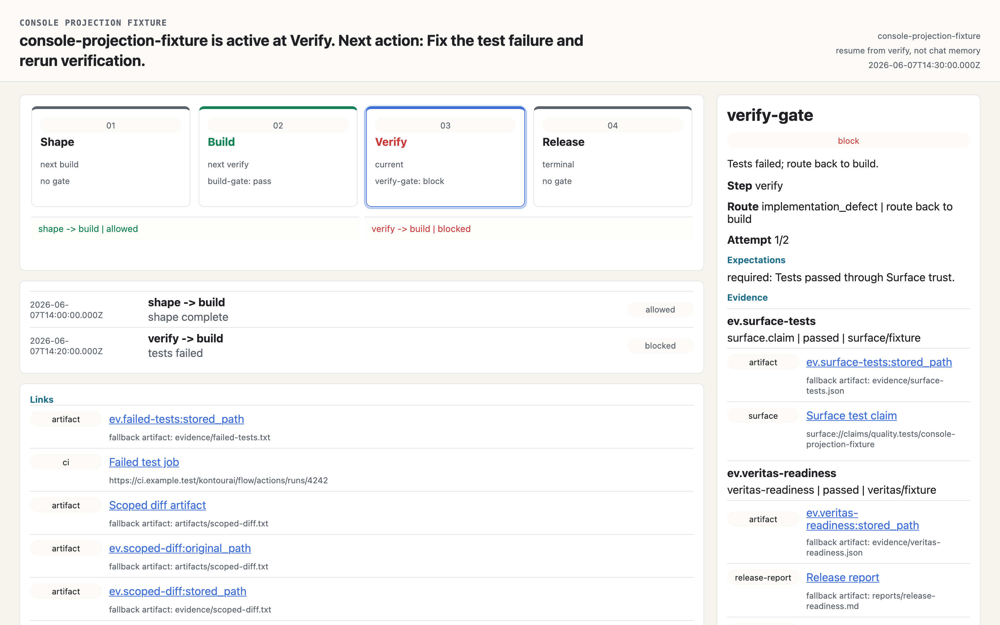

<div align="center">

# Kontour Flow

**Proof, not promises. Flow shows why work was allowed to move forward.**

[](https://www.npmjs.com/package/@kontourai/flow)
[](https://github.com/kontourai/flow/actions/workflows/ci.yml)
[](LICENSE)
[](package.json)

[Documentation](https://kontourai.github.io/flow/) · [Getting Started](docs/getting-started.md) · [Use Cases](docs/use-cases.md) · [CLI Reference](docs/cli.md)

</div>

---

AI agents move faster than humans can inspect. They skip steps, accept weak evidence, declare work complete after partial verification, and lose the thread after context compaction. The work *looks* done — until you ask why it was allowed to advance, and nobody can answer.

Flow is the missing record in the middle: **the required path, the evidence each gate expected, the evidence that was actually collected, and the exceptions a human explicitly accepted.** It does not run your agents and it does not replace CI. It explains — durably, locally, in plain files — why the work was allowed to advance.

```text
flow run: agent-dev-flow / feature-search-filters
current step: implement

PASS  plan gate: Acceptance criteria are ready for implementation. satisfied
WAIT  implementation gate: implementation gate waiting
WAIT  verify gate: verify gate waiting

next action: attach evidence for implementation gate
continuation: resume from implement, not chat memory
report: .kontourai/flow/runs/dev-1847/report.md
```

## Why teams adopt Flow

- **Evidence-gated transitions.** A step is not complete because an agent says so. Gates declare typed expectations, and runs advance only when evidence satisfies them — or when a human accepts an explicit, attributable exception.
- **Survives context loss.** Every run lives in plain files under `.kontourai/flow/runs/<run-id>/`. A new agent session, a teammate, or a CI job can `flow resume` and continue from recorded state, not chat memory.
- **Deterministic route-back.** Failed evidence routes work back to the right step (`implementation_defect` → implement, `plan_gap` → plan) with attempt budgets, so agents cannot loop silently forever.
- **Authorized retry epochs.** An exhausted blocked route-back can return only to its declared route in the same run through a provider-neutral, authority-bearing `flow authorize-retry` request; it preserves failure history and requires fresh re-entry evidence.
- **Audit-ready reports.** Every run regenerates a human-readable `report.md` and machine-readable `report.json` that explain what passed, what blocked, what was excepted, and what happens next.
- **Local-first, zero lock-in.** v0.1 is a file-backed CLI and TypeScript library. No hosted service, no account, no telemetry. Your evidence stays in your repo.

## See it

Thirty seconds, four commands — and a gate an agent cannot talk its way past:


The bundled local Flow Console (`flow console`) renders any run from its local files — the process graph, gate outcomes, evidence, route-backs, and the next action:



## Quickstart

```sh
npm install -D @kontourai/flow

# Scaffold .flow/ with a sample agent-dev definition
npx flow init

# Start a run for a concrete piece of work
npx flow start .flow/definitions/agent-dev-flow.json \
  --run-id dev-1847 --params subject=feature-search-filters

# Attach evidence to the current gate, then evaluate
cat > acceptance-bundle.json <<'JSON'
{
  "schemaVersion": 5,
  "source": "team/reviewer",
  "claims": [
    {
      "id": "claim.builder.acceptance",
      "subjectType": "flow-step",
      "subjectId": "builder.plan",
      "facet": "builder.acceptance",
      "claimType": "builder.acceptance",
      "fieldOrBehavior": "acceptanceCriteria",
      "value": "acceptance criteria reviewed and confirmed",
      "createdAt": "2026-06-10T00:00:00.000Z",
      "updatedAt": "2026-06-10T00:00:00.000Z"
    }
  ],
  "evidence": [
    {
      "id": "evidence.builder.acceptance",
      "claimId": "claim.builder.acceptance",
      "evidenceType": "human_attestation",
      "method": "attestation",
      "sourceRef": "team:reviewer",
      "excerptOrSummary": "Acceptance criteria reviewed and confirmed.",
      "observedAt": "2026-06-10T00:00:00.000Z",
      "collectedBy": "team/reviewer"
    }
  ],
  "policies": [],
  "events": [
    {
      "id": "event.builder.acceptance.verified",
      "claimId": "claim.builder.acceptance",
      "status": "verified",
      "actor": "team/reviewer",
      "method": "attestation",
      "evidenceIds": ["evidence.builder.acceptance"],
      "createdAt": "2026-06-10T00:00:00.000Z",
      "verifiedAt": "2026-06-10T00:00:00.000Z"
    }
  ]
}
JSON

npx flow attach-evidence dev-1847 --gate plan-gate \
  --file ./acceptance-bundle.json --kind trust.bundle
npx flow evaluate dev-1847

# See where the run stands — from any session, any time
npx flow status dev-1847
npx flow resume dev-1847
```

In a hurry? `npx flow init --demo` scaffolds a ready-made run named `demo` so `flow status demo` and `flow console --run demo` have something real to show immediately.

The [Getting Started guide](docs/getting-started.md) walks this path end to end with real output, including what evidence files look like and how a blocked gate routes work back.

## Where Flow fits

Flow is the process-transparency layer of the Kontour product line: *Kontour shows the work behind AI.*

| Product | Owns |
| --- | --- |
| **[Survey](https://kontourai.io/survey)** | Producer evidence: source → extraction → candidate → review → claim |
| **[Surface](https://kontourai.io/surface)** | Portable trust state: claims, evidence, policies, trust snapshots |
| **Flow** | Process transparency: steps, gates, transitions, runs, exceptions, reports |
| **[Veritas](https://kontourai.io/veritas)** | Code/change transparency: repo standards, merge readiness |
| **[Flow Agents](https://kontourai.io/flow-agents)** | Agent-facing distribution: kits, runtime adapters, hooks |

Flow stands alone — you need none of the other products to use it. When they are present, Veritas can supply repo-readiness evidence to Flow gates, and Flow Agents can enforce Flow gates from inside Claude Code, Codex, Kiro, or GitHub Actions.

Real teams use Flow for agentic development gates, regulated release decisions, platform golden paths, adversarial review loops, and audit-ready change evidence. [Use Cases](docs/use-cases.md) walks through each with definitions you can copy.

## How it works

1. **Author a Flow Definition** — JSON describing steps, gates, typed evidence expectations, and route-back policy. Validate it with `flow validate-definition`.
2. **Start a Flow Run** — `flow start` snapshots the definition and creates authoritative run state under `.kontourai/flow/runs/<run-id>/`.
3. **Attach evidence** — test output, CI results, trust reports, human attestations. Files are copied into the run; `flow capture` can optionally create an exact command receipt first.
4. **Evaluate gates** — `flow evaluate` passes, blocks, routes back, or waits. Accepted exceptions are first-class, recorded with reason and authority.
5. **Report and resume** — `report.md` / `report.json` explain the run; `flow resume` gives the next agent everything it needs without chat memory.

```text
.kontourai/flow/runs/dev-1847/
├── definition.json        # normalized definition snapshot from run start
├── state.json             # authoritative run state (continuation authority)
├── evidence/
│   ├── manifest.json      # evidence index
│   └── ev.<id>.<ext>     # copied evidence artifacts (original extension preserved)
├── report.md              # regenerated human-readable report
└── report.json            # regenerated machine-readable report
```

## CLI

```text
flow init                          scaffold .flow/ with config and a sample definition
flow validate-definition <path>    validate a Flow Definition, with --json diagnostics
flow kit validate <kit-dir>        validate a Flow Kit container manifest
flow kit install <source>          fetch and place a Flow Kit
flow kit inspect <kit-dir>         report a kit's structural (K0) view
flow start <definition>            start a run from a definition
flow status <run-id>               summary, json, or markdown run status
flow pause <run-id>                pause a run, recording the prior status
flow resume-run <run-id>           restore a paused run to active
flow cancel <run-id>               terminally cancel a run
flow authorize-retry <run-id>      authorize a retry past an exhausted route-back
flow attach-evidence <run-id>      copy an evidence file onto a gate
flow capture <run-id>              run a command and attach its captured receipt
flow evaluate <run-id>             evaluate gates and advance, block, or route back
flow accept-exception <run-id>     pass a gate by explicit, attributed exception
flow resume <run-id>               print continuation state for the next agent
flow ready-steps <run-id>          print the steps ready to start next
flow report <run-id>               regenerated run report in summary, markdown, or json
flow list                          list local runs
flow console --run <run-id>        loopback-only local console for a run
flow config preview|apply <file>   preview and apply project config proposals
flow validate-transition <file>    validate a proposed transition against run state
flow version-release-report <file> project a versioned release report
```

Every command accepts `--cwd <path>` to scope local Flow files. Full flags, formats, and exit behavior: [CLI Reference](docs/cli.md).

## Library

The same primitives the CLI uses are exported from the package root, fully typed:

```ts
import {
  startRun,
  attachEvidence,
  evaluateRun,
  loadRun,
  validateDefinitionWithDiagnostics,
  validateRunTransition,
  projectFlowRunFromFiles
} from "@kontourai/flow";

const result = validateDefinitionWithDiagnostics(definition);
if (!result.valid) console.error(result.diagnostics);

const projection = await projectFlowRunFromFiles("dev-1847", { cwd: process.cwd() });
console.log(projection.current_step, projection.gates);
```

Public usage is limited to the package root and the `flow` CLI; `dist/` subpaths are not part of the npm API. The [Library guide](docs/library.md) covers run lifecycle, projections, release readiness evaluation, and config merge helpers.

## Runtime Roots

`.flow/config.json` and `.flow/definitions/` are durable authored project state. All generated Flow Run files and disposable demo evidence are written under `.kontourai/flow/`; `.kontourai/` is the repository ignore boundary for generated Flow state. Current runtime commands do not read `.flow/runs/` and perform no automatic migration. Installations with generated state from older Flow versions must follow the backup, collision, copy, identity-verification, and rollback procedure in [Runtime Roots](docs/runtime-roots.md).

## Documentation

| Guide | What it covers |
| --- | --- |
| [Getting Started](docs/getting-started.md) | install → first run → evidence → route-back → resume, with real output |
| [Use Cases](docs/use-cases.md) | realistic team scenarios with copyable definitions |
| [Evidence](docs/evidence.md) | evidence kinds, `trust.bundle` expectations, bundle claims, trust artifacts and bundles, diagnostics |
| [Gates & Route-Back](docs/gates-and-route-back.md) | gate evaluation rules, transitions, route-back policy, exceptions |
| [Agent Hooks](docs/agent-hooks.md) | enforcing gates from Claude Code hooks, GitHub Actions, Git hooks |
| [Project Config](docs/project-config.md) | trusted producers, gate overrides, config merge preview/apply |
| [Release Readiness](docs/release-readiness.md) | release lanes, hold/proceed decisions, version release reports |
| [CLI Reference](docs/cli.md) | every command, flag, format, and exit code |
| [Library](docs/library.md) | typed API for embedding Flow |
| [Runtime Roots](docs/runtime-roots.md) | generated-state placement, migration, and rollback guidance |
| [Developer Architecture](docs/developer-architecture.md) | lifecycle and enforcement internals, ownership boundaries |

The docs map lives at [docs/README.md](docs/README.md). Contributor setup lives in [docs/contributing.md](docs/contributing.md). Release history lives in [CHANGELOG.md](CHANGELOG.md).

## Schemas

Flow's contracts are public JSON Schemas under [`schemas/`](schemas/): Flow Definitions, Flow Runs, gate evidence, reports, transition validation, release readiness, and version release reports. `npm test` fails if the runtime drifts from the published schemas.

## Boundaries

Flow is deliberately small. It is not an agent runtime, multi-agent orchestrator, task board, repo standards engine, hosted service, or hosted web UI. Surface owns portable trust state, Veritas owns repo readiness semantics, and Flow Agents owns agent-facing workflow distribution. Flow owns one thing: the evidence-backed record of why a required path was allowed to advance.

## License

[Apache-2.0](LICENSE) © Kontour AI
