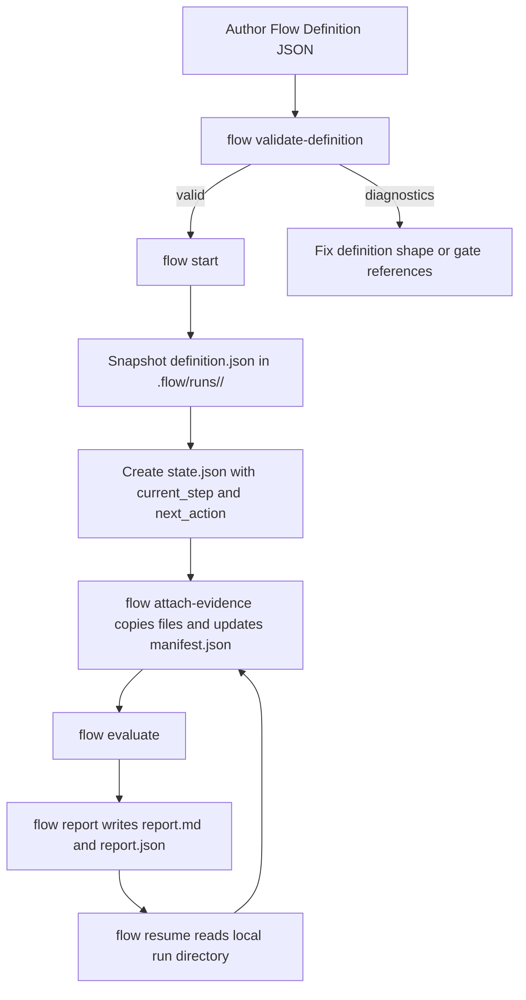
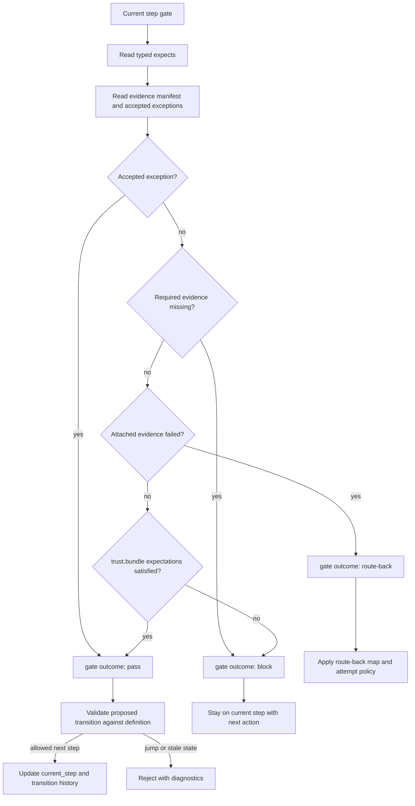
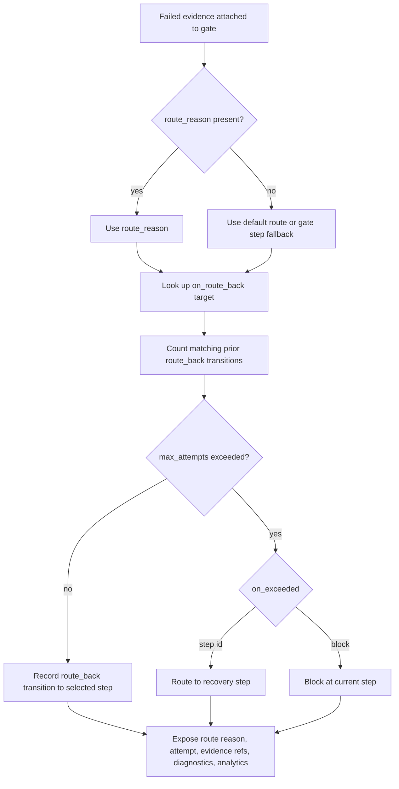
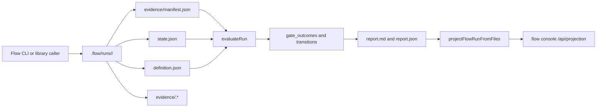
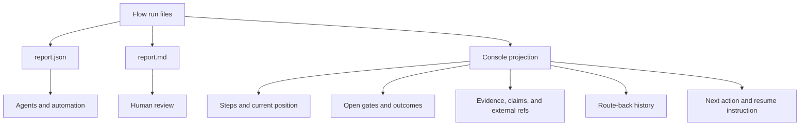
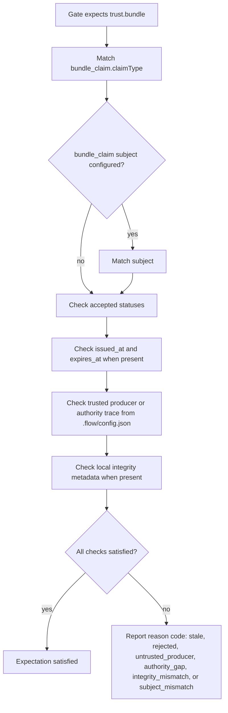
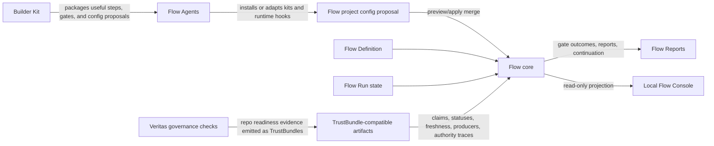

# Flow Developer Architecture

Flow is the process transparency and gate enforcement kernel for required-path work. It records the path a run is expected to follow, the typed expectations each gate declares, the evidence that was actually attached, exceptions accepted by an authority, and the continuation state another person or agent needs to resume the run locally.

This guide is self-contained for Flow developers. It explains the current v0.1 implementation, product ownership boundaries, runtime and evidence lifecycles, and the future Resource Contract alignment direction without requiring the Flow Agents cross-product guide.

For file placement, generated artifact policy, and validation lane ownership, see the repo structure guide in [docs/repo-structure.md](repo-structure.md).

## Current Implementation

Flow v0.1 is a local, file-backed CLI and library published as `@kontourai/flow`.

Flow owns these primitives:

- Flow Definitions: authored process shape with steps, gates, expectations, route-back maps, and route-back policy.
- Flow Runs: local run state under `.flow/runs/<run-id>/`.
- Steps and transitions: provider-neutral movement through the authored definition.
- Gates and gate evidence: typed expectations, attached files, and copied evidence manifests.
- Accepted exceptions: explicit authority-bearing overrides that allow a gate to pass.
- Flow Reports: deterministic JSON and Markdown explanation of run state, evidence, gaps, route-back outcomes, exceptions, and next action.
- Continuation state: enough local state for `flow resume` and downstream agents to continue without chat memory.
- Console projection: a read-only, deterministic local read model derived from Flow-owned run files.

Flow does not run agents, dispatch work, replace CI, own repo governance, own Surface trust semantics, or call hosted services as part of v0.1 gate evaluation.

## Flow Definition To Run Lifecycle



Current implementation: the authoritative run record is the local run directory. `definition.json`, `state.json`, `evidence/manifest.json`, copied evidence files, `report.md`, and `report.json` are Flow-owned files.

Future Resource Contract alignment: Flow Definition, Flow Run, and Flow Project Config are strong candidates for `apiVersion`, `kind`, `metadata`, `spec`, and `status` shape. That is migration guidance only; v0.1 still uses the existing flat JSON schemas.

## Gate Evaluation And Transition Enforcement

Flow evaluates the gate for the current step and decides whether the run can advance. A runtime, adapter, or agent can propose a transition, but Flow owns provider-neutral transition legality.



Current implementation: gate evaluation uses the authored Flow Definition, local evidence manifest, accepted exceptions, and `.flow/config.json` for trusted producers and gate overrides. Transition validation checks the current state, proposed transition, gate outcomes, route-back policy, and persisted transition history. It does not inspect Flow Agents sidecars, GitHub boards, hosted providers, or Veritas internals.

## Route-Back Loop Protection

Route-back turns failed evidence into a deterministic recovery path. Flow uses only the failed evidence `route_reason`, the gate's `on_route_back` map, route-back policy, and persisted transitions.



Current implementation: attempt counts are derived from `state.transitions`. Caller-supplied counters, timestamps, classifier data, diagnostics, and analytics metadata are recorded for reports and learning but do not affect route selection or attempt counts.

## Runtime And Evidence Lifecycle



Current implementation: `projectFlowRunFromFiles` is read-only, local-file-first, deterministic, and Flow-owned. It reads local run files and preserves explicit external refs for Surface, Veritas, artifacts, pull requests, CI, and release reports when those refs already exist in the run files. It does not synthesize refs from git, network calls, hosted services, or Markdown report parsing.

Run file authority is intentionally split:

- `definition.json` is the normalized Flow Definition snapshot captured when the run starts.
- `state.json` is the authoritative mutable continuation state and follows `schemas/flow-run.schema.json`.
- `evidence/manifest.json` is the evidence metadata index for that run and points at copied evidence files under `evidence/`.
- `report.md`, `report.json`, and console projections are derived explanations regenerated from the definition snapshot, run state, and evidence manifest.

Future Resource Contract alignment: Flow Run state, evidence manifests, reports, and console projection resources should likely be evaluated for Resource Contract shape when they become durable provider-facing or console-facing contracts. The current v0.1 runtime keeps `.flow/runs/<run-id>/state.json` flat and schema-versioned; Resource Contract support is limited to authored Flow Definition and authored Flow Project Config inputs.

## Reports And Console Projection

Flow Reports explain why a run is ready, blocked, routed back, waiting, or allowed by exception. The local console projection reshapes the same Flow-owned state for UI and operator views.



Current implementation: reports and console projections are generated explanations. They are not the source of authority for gate evaluation. The source of authority remains the Flow Definition, Flow Run state, evidence manifest, accepted exceptions, and project config.

## Trust Bundle Evidence

Flow gates are authored with typed `expects` entries. Rich claim-backed expectations use `kind: "trust.bundle"` with a `bundle_claim` selector.



Current implementation: a copied Hachure TrustBundle backs a `trust.bundle` evidence entry. Flow consumes neutral bundle fields such as `source`, `claims`, `evidence`, `policies`, and `events`. Flow matches `bundle_claim` selectors against bundle claims and events to produce normal diagnostics.

Flow does not import Surface services or Veritas-specific schema fields as the runtime contract. Veritas may produce compatible evidence, but Flow evaluates only TrustBundle fields under the Flow Definition and `.flow/config.json`.

## Local Relationship Map



Current implementation: Flow consumes claim and trust evidence through TrustBundle-compatible artifacts. Veritas governance evidence reaches Flow only when a Veritas tool emits or provides a compatible TrustBundle. Flow Agents can coordinate kits and adapters, but Flow core still decides gate outcomes and transition legality from Flow-owned contracts.

Future Resource Contract alignment: durable Flow contracts should gradually align to Kontour Resource Contract shape where migration or mapping improves clarity. Neutral Surface trust artifact projection remains an exception because wrapping it as a Flow-owned resource would blur product ownership.

## Ownership Boundaries

The canonical product ownership summary lives in the Boundaries section of [product-vision.md](product-vision.md). This architecture guide keeps only the implementation-facing rules that affect Flow runtime behavior:

- Flow owns provider-neutral process semantics: definitions, runs, steps, gates, transitions, route-back policy, evidence manifests, accepted exceptions, reports, continuation, transition validation, config merge semantics, and local console projection.
- Flow decides whether a gate passes, blocks, routes back, waits, or is allowed by accepted exception from Flow-owned contracts and local project config.
- `.flow/config.json` is the Flow authority source for trusted producer mappings and gate overrides during gate evaluation.
- TrustBundle-compatible artifacts are evidence inputs; Flow does not decide global Surface trust meaning or call Surface services in v0.1 gate evaluation.
- Veritas readiness can appear as compatible evidence; Flow does not import Veritas policy semantics.
- Flow Agents and Builder Kit can package, install, adapt, or propose Flow definitions/config, but Flow core does not special-case agent runtimes or step names.

Kontour Resource Contracts own cross-product shape conventions:

- New durable, agent-facing, provider-facing, CLI-facing, cross-product, or user-authored Kontour contracts should normally align to `apiVersion`, `kind`, `metadata`, `spec`, and `status`.
- Flow has not migrated all v0.1 schemas to that shape. Current Resource Contract support is implemented only for authored Flow Definition and authored Flow Project Config inputs. Flow Run state, gate evidence manifests, reports, transition validation results, console projections, Flow Agents artifacts, and Builder Kit adapters remain flat or product-native contracts until a future migration slice changes them deliberately.

## Current Versus Future Summary

Current implementation:

- Flow v0.1 is local and file-backed.
- Flow Definitions, Flow Runs, evidence manifests, Flow Reports, project config, transition validation, release readiness outputs, and version release reports use the current v0.1 schemas.
- Console projection is read-only and derived from local Flow run files.
- TrustBundle evidence is consumed through neutral copied artifacts.
- Veritas is an optional evidence producer, not a runtime dependency.
- Flow Agents and Builder Kit are consumers or packagers of Flow contracts, not owners of Flow gate semantics.

Future Resource Contract alignment:

- Flow Definition, Flow Run, Flow Project Config, future console projections, future run control records, review queues, and review items are migration candidates.
- Flow Reports, evidence manifests, config merge reports, definition validation results, and transition validation results should likely keep current useful shapes while adding explicit mappings if persisted or exposed through consoles/providers.
- Neutral TrustBundle evidence projection should remain trust-artifact-shaped rather than become a Flow-owned Resource Contract.
- Any migration needs a dedicated compatibility slice with schema, runtime, fixture, and documentation verification. This guide does not perform that migration.

## Non-Goals

This guide does not introduce schema migrations, runtime behavior changes, Kubernetes runtime dependencies, hosted auth, remote trust verification, signature verification, distributed execution, multi-agent orchestration, or new console control APIs.

## Verification Notes For Docs Changes

For changes to this guide, verify at least:

```sh
npm test
```

For local docs verification, check Markdown links in `README.md` and this guide, and render or parse every fenced `mermaid` block. If Mermaid CLI is not installed and network access is unavailable, record Mermaid rendering as `NOT_VERIFIED` instead of treating visual rendering as passed.
