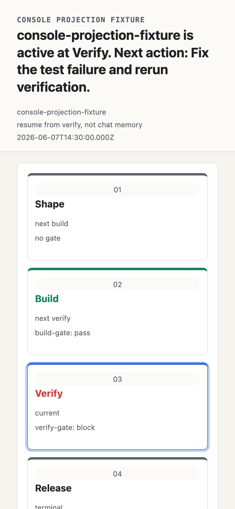

# Getting Started

This guide takes you from `npm install` to a complete, evidence-gated Flow Run — including a deliberate failure that routes work back, and a resume from recorded state. Every command and every output block below was produced by the real CLI.

Flow v0.1 is local and file-backed. Nothing here talks to a hosted service.

## Install

```sh
npm install -D @kontourai/flow
```

Requires Node.js 18 or newer.

## 1. Initialize the project

```sh
npx flow init
```

```text
initialized .flow
```

`flow init` scaffolds the local Flow layout:

```text
.flow/
├── README.md                          # what lives here and why
├── config.json                        # project authority: trusted producers, gate overrides
├── definitions/
│   └── agent-dev-flow.json            # bundled sample definition
└── runs/                              # one directory per Flow Run
```

> **Shortcut:** `npx flow init --demo` additionally scaffolds a ready-made run named `demo` — plan gate already passed, sitting at `implement` — so every command in this guide has something to show before you author anything.

The sample definition models the first-wedge agentic development path — `plan → implement → verify → publish` — with a gate on each working step. Open `.flow/definitions/agent-dev-flow.json` and look at one gate:

```json
{
  "plan-gate": {
    "step": "plan",
    "expects": [
      {
        "id": "acceptance-criteria",
        "kind": "surface.claim",
        "required": true,
        "description": "Acceptance criteria are ready for implementation.",
        "claim": {
          "type": "builder.acceptance",
          "subject": "builder.plan",
          "accepted_statuses": ["trusted", "reviewed"]
        }
      }
    ]
  }
}
```

This is the core idea: the gate declares **what evidence it expects** in a typed shape, before any work runs. An agent cannot satisfy this gate by summarizing; it has to attach evidence that matches.

## 2. Start a run

A Flow Run is one execution of a definition for a concrete piece of work:

```sh
npx flow start .flow/definitions/agent-dev-flow.json \
  --run-id dev-1847 --params subject=feature-search-filters
```

```text
started flow run: dev-1847
current step: plan
report: .flow/runs/dev-1847/report.md
```

Flow snapshots the definition and creates the authoritative run state:

```text
.flow/runs/dev-1847/
├── definition.json        # normalized definition snapshot from run start
├── state.json             # authoritative mutable run state
├── evidence/manifest.json # evidence index
├── report.md              # regenerated human-readable report
└── report.json            # regenerated machine-readable report
```

`state.json` is the continuation authority. Reports and console views are derived explanations — they are never the source of truth for gate evaluation or resume.

## 3. Attach evidence and evaluate

The plan gate expects a `builder.acceptance` claim. Create a small trust artifact that carries it — in a real team this is produced by a reviewer, a CI job, or a Veritas check rather than written by hand:

```sh
cat > acceptance-claim.json <<'EOF'
{
  "schema_version": "0.1",
  "artifact_type": "trust-report",
  "subject": "builder.plan",
  "producer": "team/reviewer",
  "status": "trusted",
  "issued_at": "2026-06-10T00:00:00.000Z",
  "claims": [
    { "type": "builder.acceptance", "subject": "builder.plan", "status": "trusted" }
  ]
}
EOF

npx flow attach-evidence dev-1847 --gate plan-gate \
  --file ./acceptance-claim.json --trust-artifact
```

```text
attached evidence: ev.1781101620469.1
gate: plan-gate
kind: surface.claim
```

The file is **copied** into `.flow/runs/dev-1847/evidence/` and indexed in the manifest — the run directory stays self-contained even if the original file changes or disappears. Now evaluate:

```sh
npx flow evaluate dev-1847
```

```text
pass plan-gate: Acceptance criteria are ready for implementation. satisfied
current step: implement
next action: attach evidence for implementation gate
```

The gate passed, so the run advanced to `implement`. Check status at any point:

```sh
npx flow status dev-1847
```

```text
flow run: agent-dev-flow / feature-search-filters
current step: implement

PASS  plan gate: Acceptance criteria are ready for implementation. satisfied
WAIT  implementation gate: implementation gate waiting
WAIT  verify gate: verify gate waiting

next action: attach evidence for implementation gate
continuation: resume from implement, not chat memory
report: .flow/runs/dev-1847/report.md
```

## 4. Fail a gate and watch route-back

Attach the implementation evidence the same way (a `implementation.scoped-diff` claim), evaluate, and the run reaches `verify`. Now suppose the test suite fails. Attach the failing output as evidence with a route reason:

```sh
npx flow attach-evidence dev-1847 --gate verify-gate \
  --file ./test-output.json --kind command \
  --status failed --route-reason implementation_defect

npx flow evaluate dev-1847
```

```text
route-back verify-gate: verify gate has failing evidence
current step: implement
next action: return to implement and replace failing evidence attempt 1/3
```

The verify gate's `on_route_back` map says `implementation_defect` returns to `implement`, and its `route_back_policy` caps attempts at 3. The failure is not hidden, not retried silently, and not summarized away — it is a recorded transition with a reason, an attempt count, and a budget. See [Gates & Route-Back](gates-and-route-back.md) for the full rules.

## 5. Resume from recorded state

This is the part that survives context compaction, session handoff, and "the agent forgot what it was doing":

```sh
npx flow resume dev-1847
```

```text
flow run: agent-dev-flow / feature-search-filters
current step: implement
next action: return to implement and replace failing evidence attempt 1/3
open gates: implement-gate
accepted exceptions: none
route backs: verify-gate implementation_defect -> implement attempt 1/3, limit exceeded no
guidance: continue from recorded Flow state; return to implement and replace failing evidence attempt 1/3
```

`flow resume` reads only the run directory. Any agent, teammate, or automation that can read these lines knows exactly where the work stands and what to do next — no chat history required.

## 6. Inspect the run in the local console

```sh
npx flow console --run dev-1847
```

The console is loopback-only and read-only. It serves the process graph, transition timeline, gate details, evidence, and links — all projected from the same local run files.



## Exceptions: advancing anyway, on the record

Sometimes the right call is to proceed without the expected evidence — a hotfix, an unavailable system, a judgment call. Flow makes that explicit instead of silent:

```sh
npx flow accept-exception dev-1847 --gate verify-gate \
  --reason "browser evidence unavailable in CI; verified manually on staging" \
  --authority "brian@kontour.ai"
```

An accepted exception counts as a pass, and it is permanently recorded in the run state and every report — what was skipped, why, and on whose authority.

## Where to go next

- [Use Cases](use-cases.md) — realistic team scenarios with definitions you can copy.
- [Agent Hooks](agent-hooks.md) — make agents unable to stop or push while gates are open.
- [Evidence](evidence.md) — evidence kinds, `surface.claim` expectations, trust artifacts, and diagnostics.
- [Gates & Route-Back](gates-and-route-back.md) — the complete evaluation and routing rules.
- [CLI Reference](cli.md) — every command, flag, and format.
